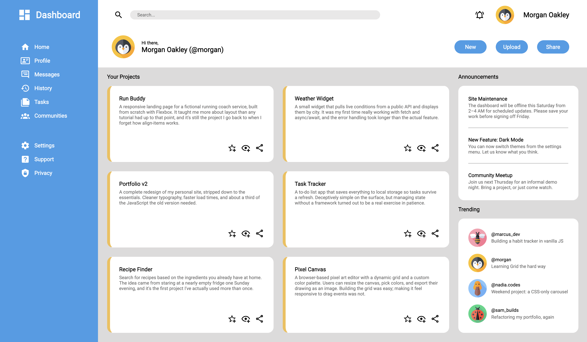

## Admin Dashboard

This project is part of the [Intermediate HTML and CSS](https://www.theodinproject.com/lessons/node-path-intermediate-html-and-css-admin-dashboard) course from [The Odin Project](https://www.theodinproject.com/).

### Requirements

The goal is to build a dashboard interface using CSS Grid, recreating (or freely adapting) the provided design file. The layout is made up of three main regions: a sidebar, a header, and a main content area, each of which nests further grid containers inside it:

- **Sidebar:** branding and navigation links.
- **Header:** search bar, user info, and action buttons.
- **Main content:** project cards, an announcements panel and a trending panel.

The project does not need to be responsive. Icons come from [Material Design Icons](https://pictogrammers.com/library/mdi/) and the reference design uses the `Roboto` typeface.

## Live Demo

[Try It Here](https://circobit.github.io/admin-dashboard/)

## Screenshots

